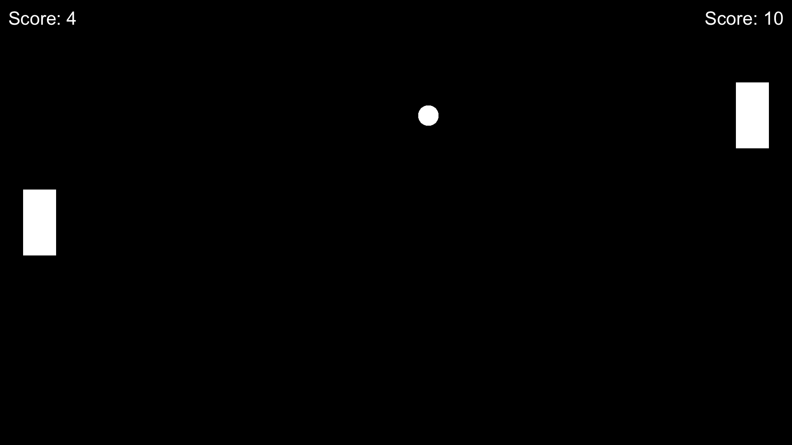

# Pong in ASPL
This is a simple version of the computer game classic <a href="https://de.wikipedia.org/wiki/Pong">Pong</a> implemented in the ASPL programming language.
 I (Wertzui123) have written this implementation in 1 hour for fun back in 2022. It was the first time I wrote a Pong clone.
 *Note*: some minor changes, mostly bug fixes, were made after the 1-hour period.
 Have fun playing!

</img>

## Known bugs
* The velocity randomly given to the ball at the start of each round is sometimes weird